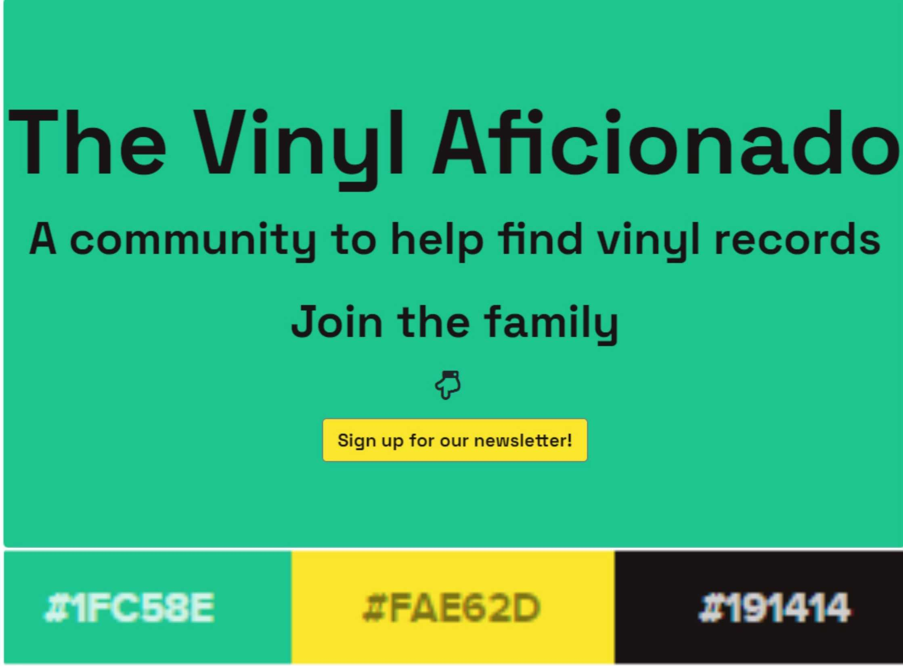

<h1 align="center"><strong>The Vinyl Aficionado</strong></h1>

<h2>1st Milestone Project</h2>

[View the live project here](https://josecastanocoding.github.io/the-vinyl-aficionado/)

The Vinyl Aficionado is a website aimed to attract vinyl enthusiasts in order to lead them to the purchase of vinyl records, vinyl accessories and/or clothing. 

The Vinyl Aficionado also offers the possibility for potential customers to sign up for a newsletter,  so a database of potential customers can be elaborated and ,furthermore, those who join can be targeted at some stage with promotions and marketing campaigns.

The website has been designed to be responsive, intuitive and accessible on a range of devices, including smartphones, tablets and desktops/laptops.

---

## Table of contents

1. [**User Experience (UX)**](#ux)
    - [**User stories**](#user-stories)
    - [**Design**](#design)
        - [**Colour Scheme**](#colour-scheme)
        - [**Typography**](#typography)
        - [**Imagery**](#imagery)
    - [**Wireframes**](#wireframes)
    
2. [**Features**](#features)
    - [**Existing features**](#existing-features)
    - [**Features left to implement**](#features-left-to-implement)

3. [**Technologies Used**](#technologies-used)

4. [**Testing**](#testing)
    - [**Testing documentation can be found here in a seperate file**](TESTING.md)

5. [**Deployment**](#deployment)
    - [**GitHub Pages**](#github-pages)
    - [**Forking the GitHub Repository**](#forking-the-github-repository)
    - [**Making a Local Clone**](#making-a-local-clone)

6. [**Credits**](#credits)
    - [**Content**](#content)
    - [**Resources**](#resources)
    - [**Media**](#media)
    - [**Acknowledgements**](#acknowledgements)

---

## User Experience (UX)

The Vinyl Aficionado partners with [therecordbloke.com](https://therecordbloke.com), as it provides its visitors with products from the latter site. I can confirm that I own [therecordbloke.com](https://therecordbloke.com) and that I myself built the site using Wordpress.

The Vinyl Aficionado also counts with another partner to provide clothing items. Such partner is [wastedheroes-shop.com](https://www.wastedheroes-shop.com/), however this is purely fictional and only used for the educational purpose of adding value to The Vinyl Aficionado. 

I can also confirm that I am not an affiliate of [wastedheroes-shop.com](https://www.wastedheroes-shop.com/)

## User stories:

-  ### <h3>First Time Visitor Goals</h3>

    1. As a First Time Visitor, I want to browse through the catalogue of products and make enquiries for items I want to purchase.
    2. As a First Time Visitor, I want to analyse the site and evaluate how easy it is to navigate throught it in order to check the products and content.
    3. As a First Time Visitor, I want to verify testimonials about the quality of the service and find out what real people think about the website. I will also corroborate
all their social media channels by clicking on the social media icons displayed on the site, with the aim of getting a deeper insight of their followings on each of the social
media platforms they are part of. 

-  ### <h3>Returning Visitor Goals</h3>

    1. As a Returning Visitor, I might want to place an order or follow up on an enquiry I recently made.
    2. As a Returning Visitor, I want to check any possible new releases or products available on the website.
    3. As a Returning Visitor, I want to keep up with any promotions running via the official social media accounts of The Vinyl Aficionado website.

## Design

- ### <h3>Colour Scheme</h3>

I did some research online and came across an article about the 50 best website color schemes for 2021 - [link here](https://designshack.net/articles/trends/best-website-color-schemes/). I picked a combination of colours that I consider to be eye-catching,
and that it has a certain e-commerce retail finish. 

There are 4 dominant colours that can be identified on my site:

- <strong>Deep emerald (#1FC58E)</strong> : Used as the background colour for the first slide of the carousel, and as the font color of the remaining slides within the carousel.
It is the main background colour of all the pages but the home page. Also used as background colour for all the call-to-action buttons.
- <strong>Color Hex Yellow (#FAE62D)</strong> : Used as the background colour of the first call-to-action button on the first slide of the carousel. It is the colour I used for the borders
of all the images displayed on the following pages: "Home", "About Me" and "Shop".
- <strong>Color Hex Black (#191414)</strong> : Used as the font colour for the text on the first slide of the carousel, headings and subheadings and all the text on the website with the exception of the navigation bar and footer.
- <strong>Radial Gradient</strong> : Used as the background colour of both the navigation bar and footer. Combination used: rgb(126,126,138) + radial-gradient(circle, rgba(126,126,138,1) 0%, rgba(255,255,255,1) 70%, rgba(233,233,233,1) 100%).

Other colours I have used:

- <strong>Color Hex Dark Grey (#777777)</strong> : Used as the font colour for the items of the navigation bar and the items in the footer.
- <strong>Color Hex White (#ffffff)</strong> : Used for the hover effect on all the buttons and for the items included in the dropdown menu of the shop.
- <strong>RGB rgb(220, 224, 212)</strong> : Used as the background colour of the home page section just underneath the carousel slider. 

- ### <h3>Typography</h3>

The font I used for all the website is "Space Grotesk".

- ### <h3>Imagery</h3>

All the images I used for my project can be found in the following [link](https://photos.google.com/u/2/album/AF1QipPOBUIe2thesg1mvdwvRcdRUe9_2owb3LXCp19p) 
Every page of the website has its GitHub folder that contains all the pictures I used. 

I used the site [Unsplash](https://unsplash.com/) to download all my images, with the exception of the ones in the page "about me", I own those ones.

## Wireframes

All the wireframes I drew can be found in the following [link](https://photos.google.com/u/2/album/AF1QipOiJG6l1mZ5Ftj5CDdoiU8IgjuenrQRaPbL6DVx)

## Features

The site counts with 6 pages in total. There is a static page (shop) that serves as a dropdown menu, and that contains 3 sub-pages.

### Existing Features

- It is responsive to screen size thanks to bootstrap and the media queries I have put in place.

- The navbar is not fixed to the top of the screen, and collapses into a hamburger button on mobile devices/smartphones.

- The carousel slider on the home page provides the visitors with a nice visual animation, as well as giving them the option to sign up for the newsletter by clicking the button on the first slide.

- There are other 3 call-to-action buttons that can be found on the home page, taking the user to visit all the sections contained in the shop.

- Hover animations are used on the navigation items in the navigation menu (underline from left), and the social media icons (float shadow) in the footer section.

- All the products listed in the page shop, under the categories of vinyl and accessories, are provided via my own website [therecordbloke.com](https://therecordbloke.com). All the clothing products are provided via another third 
party called [wastedheroes-shop.com](https://www.wastedheroes-shop.com/). The call-to-action buttons will allow the user to go directly to both sites and place orders. 
  
### Features Left to Implement

- Have the subscription form add the visitor details to an email list database. 

 ##### back to [contents](#table-of-contents)

---
## Technologies Used

- Languages : HTML, CSS and Bootstrap framework (Navbar uses JavaScript).

- IDE: [Gitpod](https://www.gitpod.io/) (runs Visual Studio code online).

- Version control: Git on [Gitpod](https://www.gitpod.io/) and [Github](https://github.com/).

- Wireframe: [Balsamiq](https://balsamiq.com/)

- Browser Developer tools : [Google Chrome](https://www.google.com/chrome)

- Markdown editor: [Typora](https://typora.io/) was used when doing spellchecks and big changes to my README.md file, Gitpod editor was used for minor updates.

- Fonts : [Google Fonts](https://fonts.google.com/)

- Icons : [Fontawesome](https://fontawesome.com/)

- Colours palette : [Canva](https://www.canva.com/colors/color-palette-generator/) was used for automatically selecting green colours from images.

- Colour tool : [Google Material Design Color Tool](https://material.io/resources/color/#!/?view.left=0&view.right=1&secondary.color=9db769&primary.color=4e5c28&secondary.text.color=000000&primary.text.color=ffffff) was used when trying to decide what colour to use against which background.

- HEX to RGB converter : [RapidTables](https://www.rapidtables.com/convert/color/hex-to-rgb.html) and [webfx](https://www.webfx.com/web-design/hex-to-rgb/)

- Colour contrast checking for Accessibility refinements : [WebAIM](https://webaim.org/resources/contrastchecker/) was used for when trying to decide what colours to use for text against which background colour.

- Favicon creator : [favicon.io](https://favicon.io/favicon-generator/)

- Autoprefixer CSS : [Autoprefixer](https://autoprefixer.github.io/)

- Auto formatter for HTML and CSS : [dirtyMarkUp](https://www.10bestdesign.com/dirtymarkup/) and  [webformatter](https://webformatter.com/html)

- Image conversion tool to WEBP (Next gen image format) : [XnConvert](https://www.xnview.com/en/xnconvert/)

##### back to [contents](#table-of-contents)  

---
## Testing

 

##### back to [contents](#table-of-contents)

---
## Deployment

**GitHub Pages**

The project was deployed to GitHub Pages using the following steps...

1. Log in to GitHub and locate the GitHub Repository.
2. At the top of the Repository (not top of page), locate the "Settings" Button on the menu. 
3. Scroll down the Settings page until you locate the "GitHub Pages" Section. 
4. Under "Source", click the dropdown called "None" and select "Master Branch".
5. The page will automatically refresh.
6. Scroll back down through the page to locate the now published site link in the "GitHub Pages" section.

**Forking**

You may wish to contribute to this website and have your contribution published, if so, you are welcome to follow these steps below.

1. Log in to GitHub and locate the GitHub Repository
2. Open https://josecastanocoding.github.io/the-vinyl-aficionado/ 
3. At the top of the Repository (not top of page) just above the "Settings" Button on the menu, locate the "Fork" Button.
4. You should now have a copy of the original repository in your GitHub account.

**Making a Local Clone**

If you prefer working on the repository locally, you can clone the repository to your desktop by the following steps.

1. Go to [the vinyl aficionado github page](https://josecastanocoding.github.io/the-vinyl-aficionado/)
2. Under the repository name, click "Clone or download".
3. - To clone the repository using HTTPS, under "Clone with HTTPS", click the paste icon. 
   - To clone the repository using an SSH key, click Use SSH, then click the paste icon. 
   - To clone a repository using GitHub CLI, click Use GitHub CLI, then click the paste icon.
4. Open Git Bash.
5. Change the current working directory to the location where you want the cloned directory.
5. Type 'git clone', then paste the URL you copied earlier above. 
6. Press Enter to create your local clone.

##### back to [contents](#table-of-contents)  

---
## Credits

### Content

- [The Record Bloke](https://therecordbloke.com) 
- [Wasted Heroes](https://www.wastedheroes-shop.com/)

### Resources

- [Code Institute](https://learn.codeinstitute.net/)
- [Typewolf](https://www.typewolf.com/google-fonts)
- [Design Shack](https://designshack.net/articles/trends/best-website-color-schemes/)
- [Unsplash](https://unsplash.com/)
- [Bootstrap components](https://getbootstrap.com/)
- [W3schools](https://www.w3schools.com/)
- [Code institute's Slack workspace channels](https://slack.com)
- [CSS tricks](https://css-tricks.com/) 
- [Stack Overflow](https://stackoverflow.com/)
- [Hover.css](https://ianlunn.github.io/Hover/#effects)
- [CSS Gradient](https://cssgradient.io/gradient-backgrounds/)

### Acknowledgements

- [The Record Bloke](https://therecordbloke.com) 
- [Wasted Heroes](https://www.wastedheroes-shop.com/)
- Various people at the [code institute](https://codeinstitute.net/) and on the code institute Slack channel.
- Various people at [LinkedIn](https://www.linkedin.com/)
- My career consultant Stuart Crang.
- My mentor Aaron.

 ##### back to [contents](#table-of-contents)   

